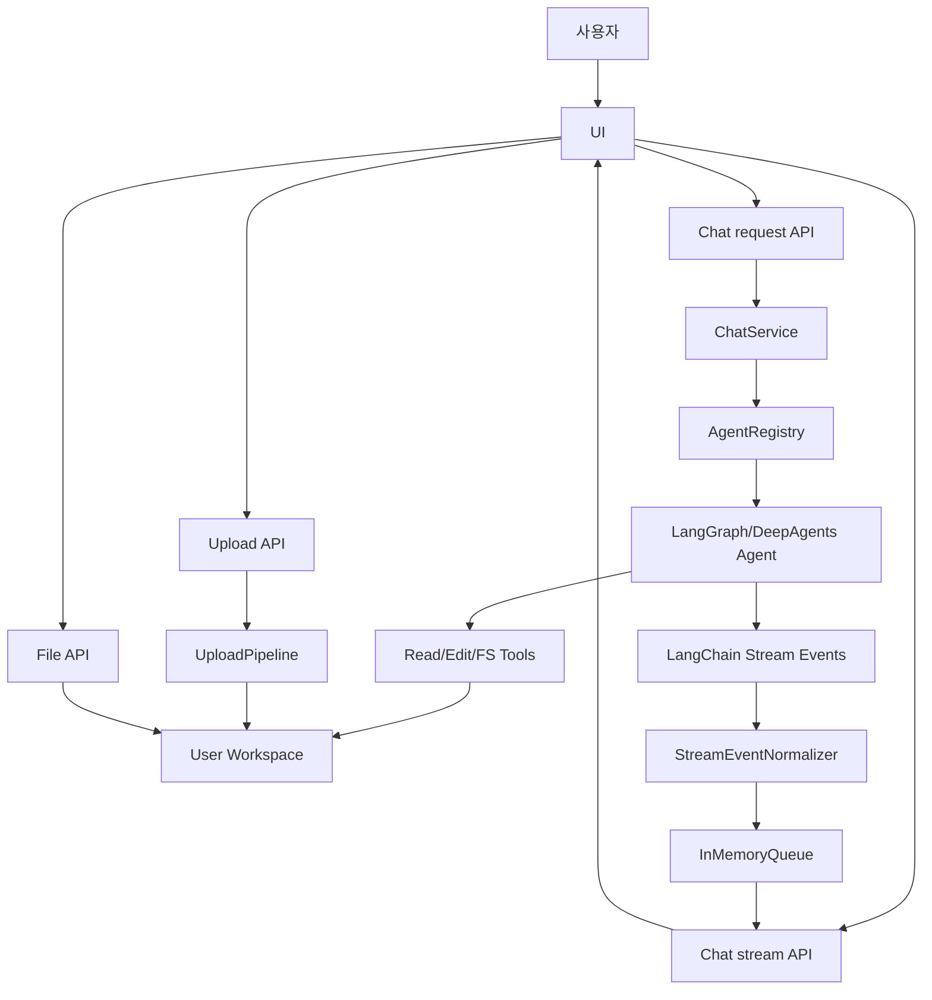
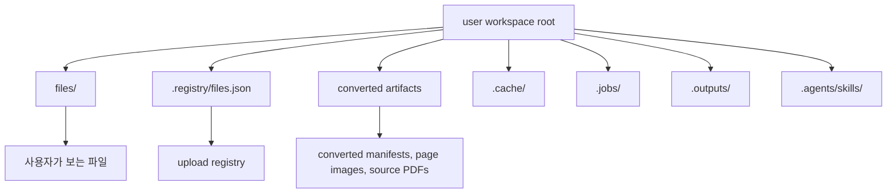
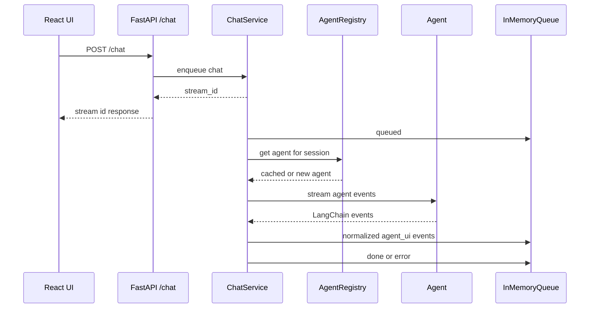
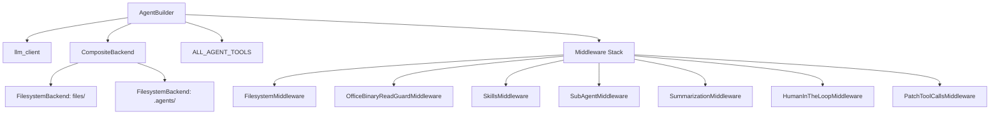
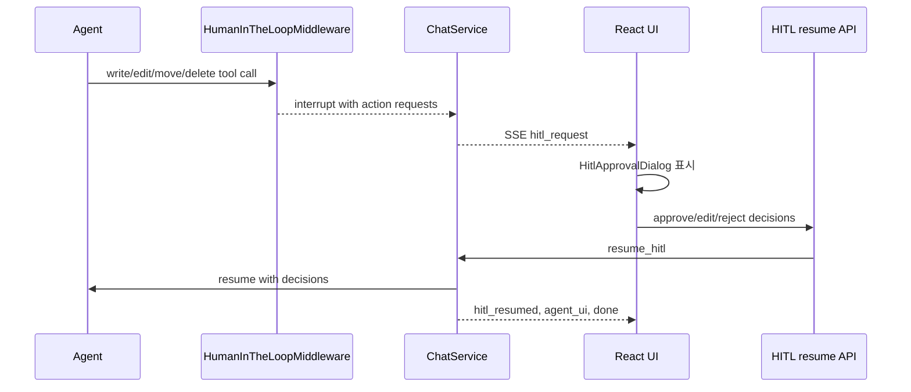
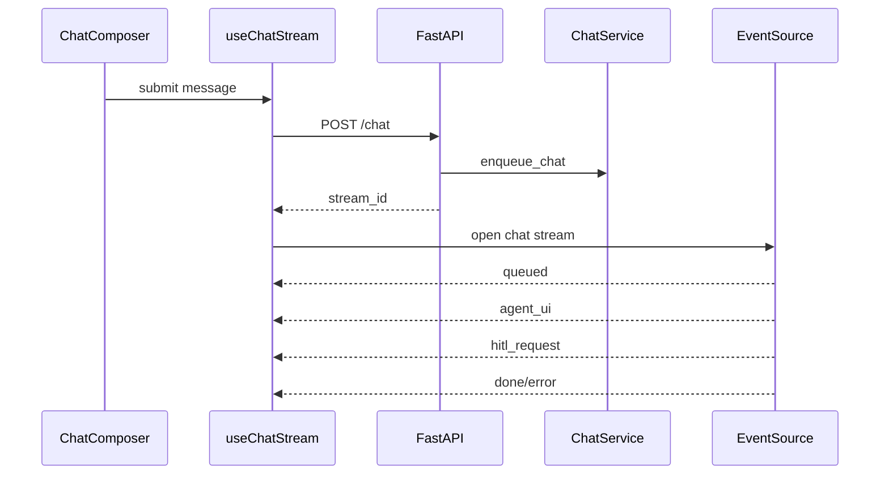
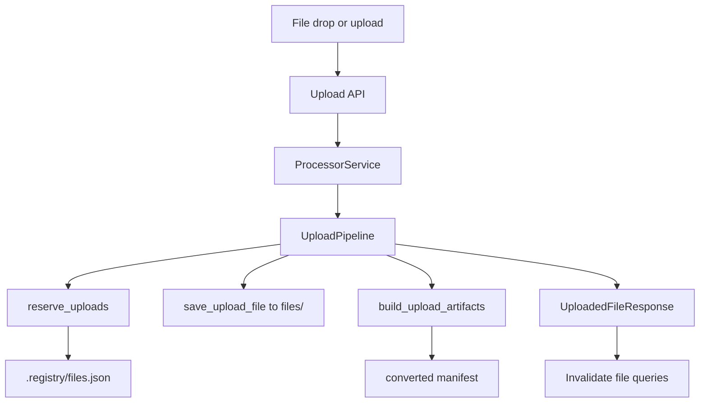
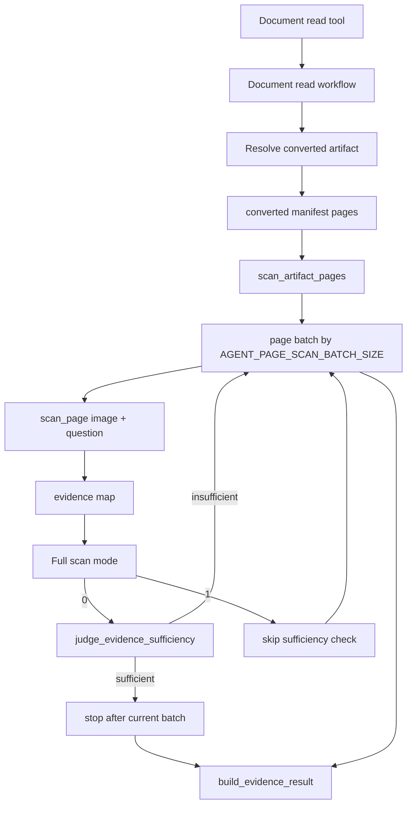
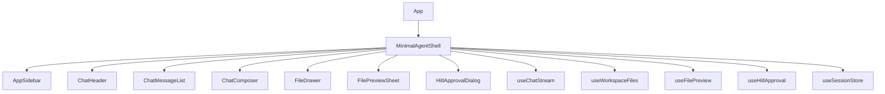

# MinimalAgent 시스템 개요

이 문서는 MinimalAgent API/UI 시스템의 제품 개요, 런타임 하네스, 백엔드/프론트엔드 연동, 지원 기능, 주요 API 계약을 한 번에 이해하기 위한 운영 문서다.

MinimalAgent는 로컬 workspace를 중심으로 동작하는 채팅형 에이전트 시스템이다. 사용자는 UI에서 세션을 선택하고, 파일을 업로드하거나 첨부하고, 에이전트에게 문서 읽기/요약/검토/파일 작업을 요청한다. 백엔드는 FastAPI API, LangChain/LangGraph 기반 에이전트 실행, DeepAgents 파일/스킬/서브에이전트 middleware, workspace-backed 파일 처리, SSE 스트리밍을 담당한다.

## 핵심 흐름



주요 사용자 경험은 네 가지다.

- 채팅 스트리밍: 사용자가 메시지를 보내면 UI는 `POST /chat`으로 `stream_id`를 받고, `EventSource`로 `/chat/stream/{stream_id}`를 구독한다.
- 에이전트 활동 가시화: 백엔드는 LangChain raw event를 `agent_ui` 이벤트로 정규화하고, UI는 assistant/reasoning/activity 이벤트를 분리 렌더링한다.
- 로컬 workspace 파일 작업: 사용자-visible 파일은 `files/`에 두고, 변환물과 registry는 내부 디렉터리에 둔다.
- 문서/오피스 workflow: PDF/DOCX/HWPX/PPTX는 변환된 페이지 artifact를 읽고, XLSX는 workbook/range 기반 workflow로 처리한다.

## 런타임 구성

`main.py`가 FastAPI 앱의 진입점이다. 시작 시 `env.backend.toml`을 config loader에 로드하고, 다음 라우터를 포함한다.

| 영역 | 라우터 | 역할 |
| --- | --- | --- |
| Chat | `POST /chat` | 에이전트 실행 요청을 enqueue하고 `stream_id` 반환 |
| Chat | `GET /chat/stream/{stream_id}` | agent UI 이벤트를 SSE로 스트리밍 |
| Chat | `POST /chat/hitl/{stream_id}` | HITL 승인/수정/거절 결정을 받아 agent 실행 재개 |
| Files | `GET /api/fs/list` | public workspace 파일/폴더 목록 조회 |
| Files | `GET /api/fs/search` | public workspace 파일 검색 |
| Files | `POST /api/fs/files` | public workspace 파일 생성 |
| Files | `DELETE /api/fs/files` | public workspace 파일 삭제 |
| Files | `POST /api/fs/move` | public workspace 파일 또는 폴더 이동 |
| Files | `POST /api/fs/rename` | public workspace 파일 또는 폴더 이름 변경 |
| Files | `GET /api/fs/preview` | 파일 프리뷰 metadata 조회 |
| Files | `GET /api/fs/preview/source` | 프리뷰용 원본 또는 변환 source 파일 반환 |
| Files | `GET /api/fs/outputs/{job_id}/files/{filename}` | output job의 개별 결과 파일 다운로드 |
| Files | `GET /api/fs/outputs/{job_id}/result.zip` | output job 결과 bundle zip 다운로드 |
| Upload | `POST /api/upload` | multipart 업로드와 변환 artifact 생성 |
| Session | `POST /api/session/title` | 세션 제목 생성 |
| Skills | `GET /api/skills/search` | workspace skill 검색 |
| UI | `GET /` | `/ui`로 redirect |
| UI | `GET /ui` | frontend index 반환 |
| UI | `/ui/*` | `ui/dist` 정적 frontend build 서빙 |

FastAPI는 완성된 frontend build를 `/ui` 아래에서 정적으로 제공한다. 개발 중에는 UI dev server를 따로 띄울 수 있지만, 배포/통합 기준은 `bun run build` 결과인 `ui/dist`다.

## Workspace 모델

MinimalAgent의 파일 시스템 계약은 user-visible 영역과 내부 상태 영역을 명확히 분리한다.



- `files/`: UI와 에이전트가 사용자 파일로 보는 public workspace다.
- `.registry`: 업로드 파일 ID, 상태, public path, 변환 상태를 기록한다.
- `.converted`: 문서 변환 결과, page image, manifest 등 내부 artifact를 보관한다.
- `.outputs`, `.jobs`, `.cache`: 내부 작업 결과와 캐시를 보관한다.
- `.agents/skills`: workspace skill을 보관하되 일반 파일 API 응답에는 노출하지 않는다.

API와 에이전트는 internal path를 사용자에게 노출하면 안 된다. public response에는 `/report.pdf`, `files/report.pdf` 같은 사용자-visible 경로만 사용한다.

## 하네스 엔지니어링

여기서 하네스는 LLM/agent 실행을 제품 기능으로 안정적으로 감싸는 런타임 구조를 뜻한다. MinimalAgent의 하네스는 실행, 이벤트, 파일, 승인, 테스트의 다섯 축으로 나뉜다.

### 실행 하네스

`ChatService`는 chat request를 비동기 작업으로 실행하고, 결과를 stream queue에 넣는다.



핵심 책임은 다음과 같다.

- `ChatService`: request queueing, workspace lock, agent stream 실행, SSE event queue, HITL pending state 관리. 
- `AgentRegistry`: `user_id:uuid` 단위 agent cache, TTL/overflow cleanup.
- `AgentBuilder`: workspace-backed agent 구성, tools/middleware/subagents 연결.
- `WorkspaceLockManager`: 같은 user workspace에 대한 upload/chat/resume 충돌을 줄인다.

### AgentBuilder 구성

`AgentBuilder`는 DeepAgents/LangChain agent를 만들 때 다음 구성요소를 연결한다.



에이전트는 ordinary text/code 파일은 filesystem tools로 다루고, PDF/DOCX/HWPX/PPTX/XLSX 같은 office/binary 문서는 전용 read/edit 도구를 사용한다.

### 이벤트 하네스

LangChain/LangGraph raw stream event는 UI가 직접 소비하기에는 너무 상세하고 불안정하다. `StreamEventNormalizer`가 raw event를 UI 계약으로 축약한다.

| Raw event | UI event | UI 처리 |
| --- | --- | --- |
| `on_chat_model_stream` text | `assistant_delta` | assistant message에 append |
| `on_chat_model_stream` reasoning | `think_delta` | reasoning message로 append |
| `on_tool_start/end/error` | `activity` | activity timeline entry 생성/병합 |
| `on_custom_event` | `activity` | workflow activity로 표시 |
| HITL interrupt | `hitl_request` | approval dialog open |
| stream end | `done` | activity 완료 처리, history 저장 |
| error | `error` | error message 표시 |

이벤트는 `InMemoryQueue`에 `chat:{stream_id}` key로 쌓이고, `/chat/stream/{stream_id}`가 SSE 형식으로 전달한다.

### HITL 하네스

파일 변경 도구는 `HumanInTheLoopMiddleware` 정책에 따라 승인 interrupt를 발생시킨다.



지원 결정은 `approve`, `edit`, `reject`다. UI는 `useHitlApproval`로 dialog state를 관리하고, 백엔드는 pending stream 정보를 보관한 뒤 resume한다.

## Backend 기능

### Chat API



`POST /chat` request body:

```json
{
  "user_id": "user",
  "uuid": "session",
  "message": "사용자 요청",
  "chat_history": [
    { "role": "user", "content": "이전 메시지" },
    { "role": "assistant", "content": "이전 답변" }
  ]
}
```

`GET /chat/stream/{stream_id}`는 SSE를 반환한다. 주요 event name은 `queued`, `agent_ui`, `hitl_request`, `hitl_resumed`, `done`, `error`다.

### 파일 API

| Endpoint | Method | 역할 |
| --- | --- | --- |
| `/api/fs/list` | GET | public workspace 파일 목록 |
| `/api/fs/search` | GET | 파일 검색 |
| `/api/fs/files` | POST | 파일 생성 |
| `/api/fs/files` | DELETE | 파일 삭제 |
| `/api/fs/move` | POST | 파일/폴더 이동 |
| `/api/fs/rename` | POST | 파일/폴더 이름 변경 |
| `/api/fs/preview` | GET | 프리뷰 metadata |
| `/api/fs/preview/source` | GET | 프리뷰 원본/변환 source |

파일 API는 `user_id`, `uuid`, `path`를 받아 workspace를 찾고, internal path가 응답에 섞이지 않도록 visibility layer를 통과한다.

### 업로드와 변환



업로드는 workspace lock 안에서 처리된다. 지원하지 않는 파일 타입은 `conversion_failed`로 반환한다. 변환이 성공하면 public path를 UI에 반환하고, UI는 파일 목록과 검색 cache를 invalidate한다.

### 문서 읽기 workflow

PDF/DOCX/HWPX/PPTX는 공통 페이지 스캔 workflow를 사용한다.



`full_scan`은 페이지를 어디까지 볼지 결정한다.

| 값 | 동작 | 사용 예 |
| --- | --- | --- |
| `0` | batch 단위로 스캔하고, evidence가 충분하면 중단 | 특정 내용 찾기, 존재 여부 확인, 좁은 질문 |
| `1` | sufficiency 체크 없이 전체 페이지 스캔 | 전체 요약, 전체 검토, 문서 전반 분석 |

`AGENT_PAGE_SCAN_BATCH_SIZE`는 최대 스캔 수가 아니라 한 번에 처리하는 batch size다.

XLSX는 page image 스캔이 아니라 workbook metadata와 명시 range 중심으로 읽는다. XLSX 편집은 별도 editor subagent와 workbook session workflow를 사용한다.

## Frontend 기능

### UI 구성



주요 책임은 다음과 같다.

- `App`/`MinimalAgentShell`: 전체 layout, drag/drop, hook wiring.
- `AppSidebar`: user/session 선택, 새 세션/세션 삭제.
- `ChatHeader`: 현재 세션과 파일 drawer 진입.
- `ChatComposer`: message 작성, file mention 삽입, upload trigger.
- `ChatMessageList`: 일반 메시지와 activity block 렌더링.
- `ActivityTimeline`: agent activity summary/detail 렌더링.
- `FileDrawer`: 파일 목록, refresh, upload, rename/move/delete, preview 진입.
- `FilePreviewSheet`: PDF/HWPX/XLSX/text/code preview.
- `HitlApprovalDialog`: 승인/수정/거절 결정 입력.

### 상태 관리

| 상태 종류 | 소유자 | 예시 |
| --- | --- | --- |
| 서버 상태 | TanStack Query | 파일 목록, 파일 프리뷰, 업로드 mutation |
| 세션/로컬 UI 상태 | Zustand + localStorage | user ID, session UUID, session history, drawer open/width |
| 스트림 상태 | React state in `useChatStream` | `Idle`, `Streaming`, `Approval required`, `Resuming`, `Error` |
| HITL dialog 상태 | React state in `useHitlApproval` | active stream, request, drafts, reject message |
| composer transient state | React state/ref | upload error, editor handle, file mentions |

### 채팅 이벤트 처리

`useChatStream`은 submit 시 다음 작업을 수행한다.

1. 현재 session history를 가져온다.
2. 사용자 메시지를 UI에 즉시 append한다.
3. `createChatStream`으로 `POST /chat`을 호출한다.
4. 받은 `stream_id`로 `openChatEventSource`를 연다.
5. `agent_ui` 이벤트를 `appendAgentUiEvent`로 UI message model에 반영한다.
6. `done`이면 assistant text를 local session history에 저장하고 activity를 완료 처리한다.

`appendAgentUiEvent`는 event kind별로 UI message를 만든다.

| Event kind | UI 결과 |
| --- | --- |
| `assistant_delta` | assistant normal message에 append |
| `think_delta` | reasoning message 추가 |
| `activity` | `ActivityTraceEntry`로 변환 후 activity block에 병합 |

## Backend-Frontend 연동 계약

### Agent UI Event

UI가 소비하는 `agent_ui` payload는 크게 세 종류다.

```ts
type AgentUiEvent =
  | { kind: "assistant_delta"; text?: string; runId?: string }
  | { kind: "think_delta"; text?: string; runId?: string }
  | {
      kind: "activity";
      type?: string;
      name?: string;
      label?: string;
      message?: string;
      status?: string;
      details?: unknown;
    };
```

백엔드는 raw event detail을 숨기고 UI가 필요한 안정 필드만 보낸다. UI는 `details`를 직접 모두 노출하지 않고, `activity-timeline.ts`에서 category/target/detail로 축약한다.

### 파일 mention 계약

UI composer는 업로드된 파일 또는 drawer의 파일을 agent workspace path로 삽입한다. 에이전트가 사용하는 경로는 `/report.docx`처럼 `files/` prefix가 없는 public path다. 백엔드 system prompt와 file visibility layer는 이 계약을 강제한다.

### 프리뷰 계약

`GET /api/fs/preview`는 다음 역할을 한다.

- 파일 타입과 preview type 결정.
- browser가 직접 열 source URL 제공.
- XLSX인 경우 workbook grid payload 제공.
- HWPX/PDF/text/code인 경우 적절한 viewer가 사용할 metadata 제공.

UI는 `source_url`을 `apiResourceUrl`로 backend resource URL로 변환한다.

## 지원 기능 매트릭스

| 기능 | Backend | Frontend |
| --- | --- | --- |
| 채팅 실행 | `ChatService`, `AgentRegistry`, `AgentBuilder` | `useChatStream`, `ChatComposer` |
| SSE 스트리밍 | `/chat/stream/{stream_id}`, queue | `EventSource`, `openChatEventSource` |
| Assistant 답변 | `assistant_delta` 정규화 | `MessageCard` |
| Reasoning 표시 | `think_delta` 정규화 | reasoning message |
| Activity 표시 | tool/model/custom event 정규화 | `ActivityTimeline` |
| HITL 승인 | `HumanInTheLoopMiddleware`, `/chat/hitl` | `useHitlApproval`, `HitlApprovalDialog` |
| 파일 업로드 | `/api/upload`, `UploadPipeline` | drag/drop, composer upload, drawer upload |
| 파일 목록/검색 | `/api/fs/list`, `/api/fs/search` | `useWorkspaceFiles`, file drawer |
| 파일 변경 | FS service, HITL policy | drawer actions, approval dialog for agent changes |
| 파일 프리뷰 | `/api/fs/preview`, `/api/fs/preview/source` | `FilePreviewSheet` viewers |
| PDF/DOCX/HWPX/PPTX 읽기 | `read_*_file`, page scan workflow | chat-driven, activity visibility |
| XLSX 읽기/수정 | workbook/range/session workflow | preview grid, chat-driven edit workflow |
| 세션 제목 | `/api/session/title` | title generation after completed exchanges |
| Skill 검색 | `/api/skills/search` | composer suggestions |

## 엔지니어링 원칙

- Backend route는 얇게 유지하고 service/workflow에 위임한다.
- User-visible path와 internal path를 섞지 않는다.
- 문서 읽기와 파일 편집은 일반 filesystem read/write와 분리한다.
- UI는 server state를 TanStack Query로 관리하고, local session/UI state만 Zustand/localStorage에 둔다.
- SSE event payload는 안정적인 UI 계약으로 정규화한 뒤 전달한다.
- 실패는 숨기지 않고 사용자-visible error 또는 explicit tool result로 반환한다.
- 테스트는 observable behavior를 고정한다: API contract, event normalization, workspace visibility, upload conversion, document workflow.
